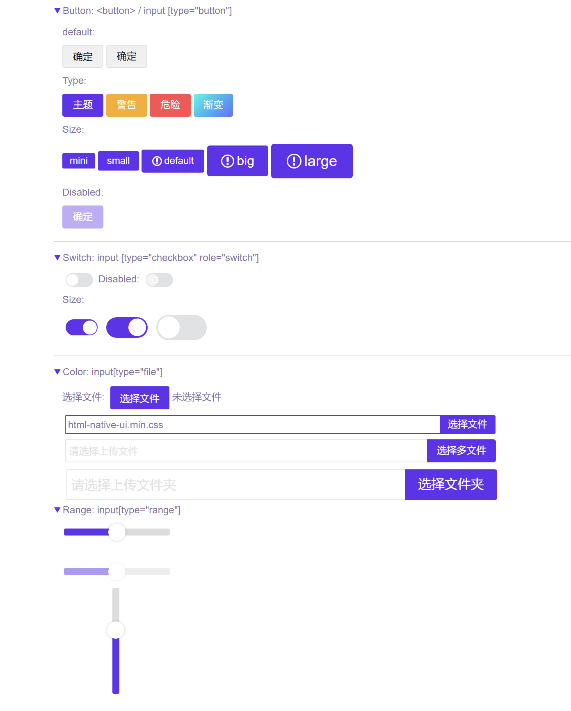

# html5-native-ui
充分利用原生html5属性和css3的能力，使原生html元素也可以变得像UI组件库一样美观优雅。Just 4.2kb gzipped

## Preview


## Install

```bash
npm i html5-native-ui
```

## Usage

Import it into your file:

```js
import 'html5-native-ui'
```
or
```html
<link rel="stylesheet" href="{path}/html5-native-ui-min.css">
```